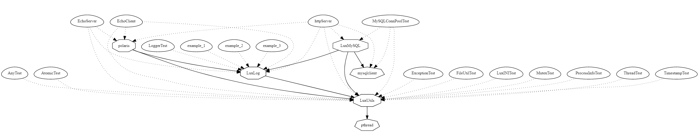
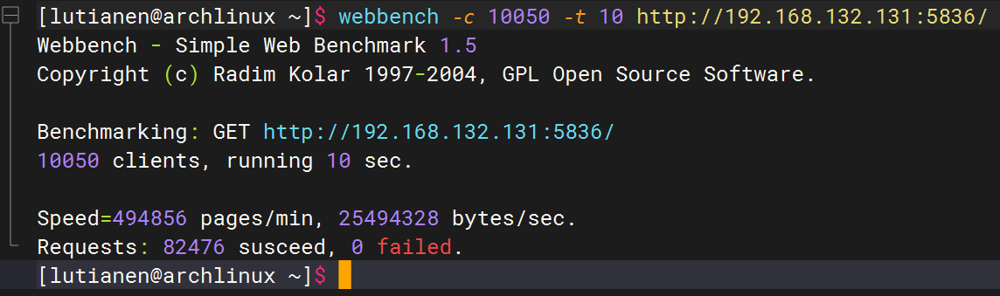

<div align=center></div>

***Lux* is a event-driven network library in Linux. This project uses the epoll I/O event notification mechanism, and it supports GET/POST requests for HTTP protocol.**

---

## Graphviz

<div align=center></div>

---

## Webbench

<div align=center></div>

---

## CMake And Run

    ```bash
    # CMake
    cmake -B build
    cmake --build build

    # Usage: ./build/app/http/httpServer serverName staticSrcPrefix serverPort numThreads [IPofMySQLServer[default: 127.0.0.1] PortofMySQLServer[default: 3306] UsernameofMySQLServer[default: lutianen] PasswordofMySQLServer[default: lutianen] DatabaseofMySQLServer[default: user]]
    ./build/app/http/httpServer LuxPolaris /home/lux/Lux/app/HTML 5836 8 192.168.1.108 3306 lutianen lutianen LuxDatabase
    ```

---

## LuxUtils

[LuxUtils](https://github.com/lutianen/Lux/blob/master/doc/LuxUtils.md)

## polaris

[polaris](https://github.com/lutianen/Lux/blob/master/doc/LuxUtils.md)

## clang-format

[食用指南](https://github.com/lutianen/Lux/blob/master/doc/clang-format.md)

## Thanks

- [muduo](https://github.com/chenshuo/muduo)
